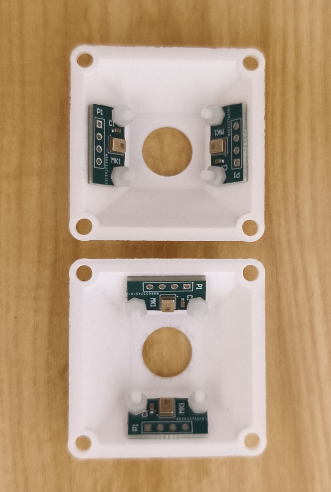
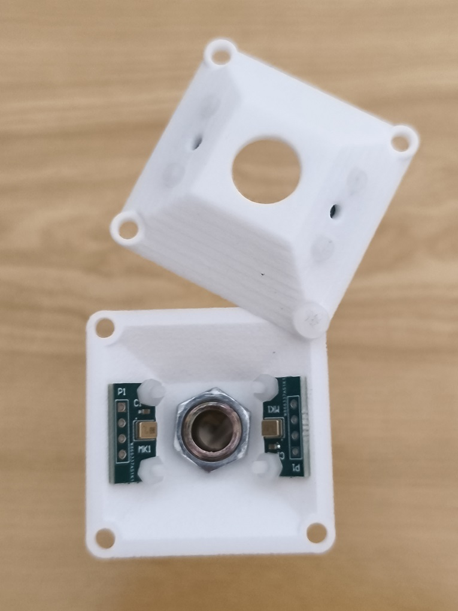
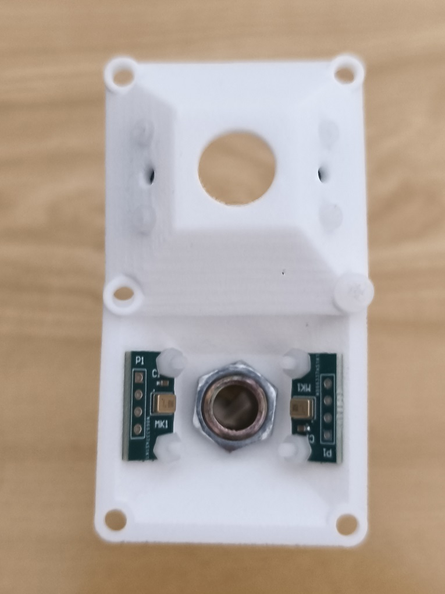
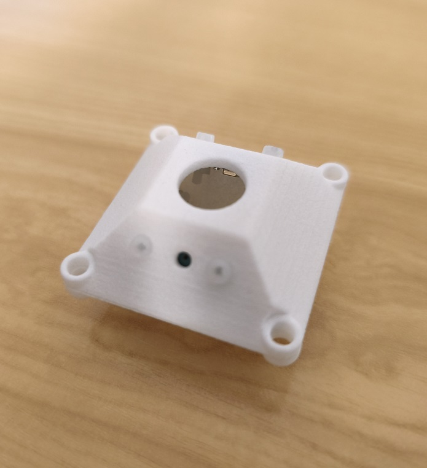
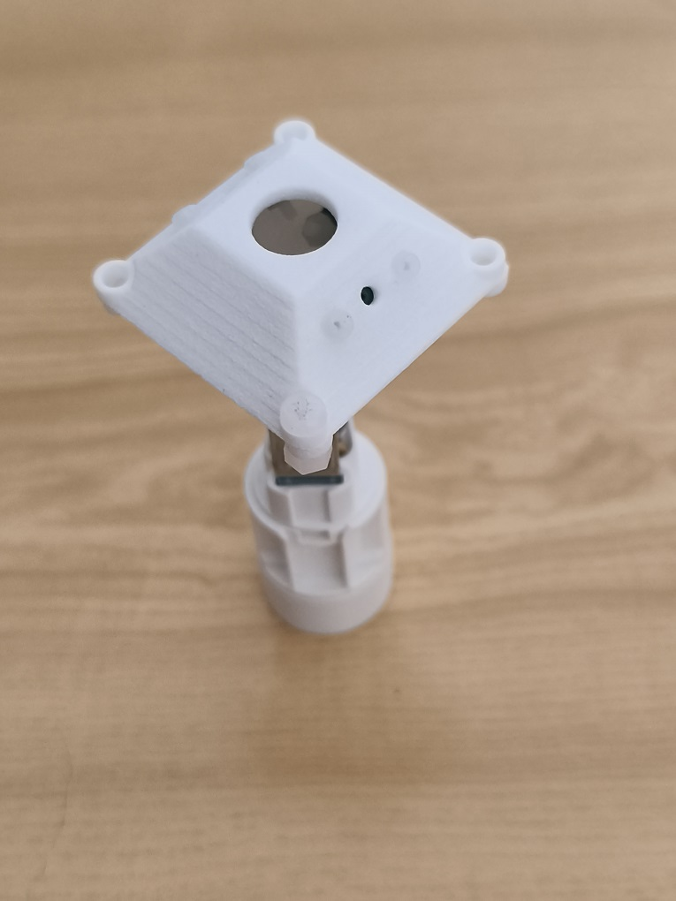
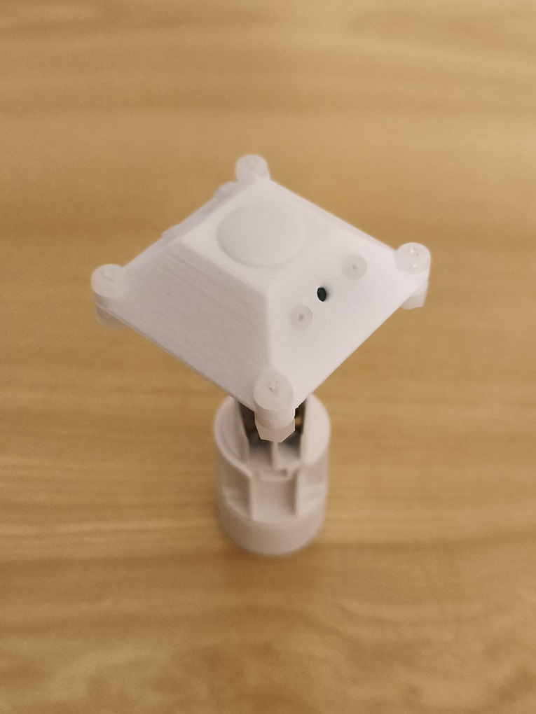
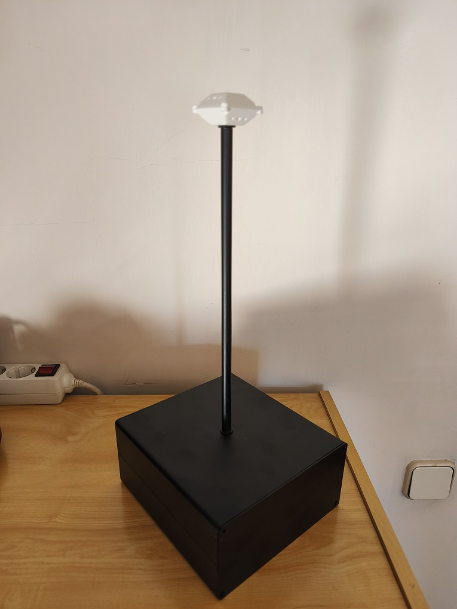

**Ambisonics**

According to Wikipedia

[https://en.wikipedia.org/wiki/Ambisonics\#Decoding](https://en.wikipedia.org/wiki/Ambisonics#Decoding)

**Ambisonics** is a *full-sphere* [surround sound](https://en.wikipedia.org/wiki/Surround_sound) format: in addition to the horizontal plane, it covers sound sources above and below the listener, created by a group of English researchers, among them Michael A. Gerzon, Peter Barnes Fellgett and John Stuart Wright, under support of the National Research Development Corporation (NRDC) of the United Kingdom. [\[1\]](https://en.wikipedia.org/wiki/Ambisonics#cite_note-1)[\[2\]](https://en.wikipedia.org/wiki/Ambisonics#cite_note-2) The term is used as both a generic name and formerly as a trademark.

Unlike some other multichannel surround formats, its transmission channels do not carry speaker signals. Instead, they contain a speaker-independent representation of a sound field called *B-format*, which is then *decoded* to the listener's speaker setup. This extra step allows the producer to think in terms of source directions rather than loudspeaker positions, and offers the listener a considerable degree of flexibility as to the layout and number of speakers used for playback.

**Ambisonics Recording with Radxa Rock-5C Card**

The Rock-5C card allows recording of up to 8 audio channels using the TDM protocol, via its I2S\_8CH\_M0 port, available on the 40-pin connector (GPIO40).

[https://radxa.com/products/rock5/5c](https://radxa.com/products/rock5/5c)

The Ensor384 card can send up to 4 audio channels at 192kHz and 32 bits per sample using the TDM protocol.

The signals we need are the following:

Pin- 12    \-\>    I2S1\_SCLK\_M0   –  GPIO4\_A3

Pin- 36    \-\>    I2S1\_LRCK\_M0  –  GPIO4\_A4

Pin- 38    \-\>    I2S1\_SDI0\_M0  –  GPIO4\_A6

The I2S1\_SCLK\_M0 (pin 12\) and I2S1\_SDI0\_M0 (pin 38\) signals correspond to the same pins on the Raspberry Pi connector.

The I2S1\_LRCK\_M0 (pin 36\) signal does not correspond to the Raspberry Pi connector (pin 35).

Since the Ensor384 board is designed to work with the RPi, we will need to make a simple adapter so that it also works with the rock-5C board.

The adapter consists of a 2x20 female connector, identical to the one on the RPi, with pin 35 removed. A wire is then soldered between pins 35 and 36 of the Ensor384 board.

The adapter connects first to the Ensor-384 card, and then the entire assembly connects to the rock-5c card.

I've tested it, and it works perfectly.

**Ambisonics Recording**

The rock-5c card, along with the Ensor-384 card, can be used to perform first-order Ambisonic recording tests with four differential microphones identical to those on the Ensor-384 card, at 192kHz/32bit.

I've noticed that some of the most commonly used microphones for Ambisonic recordings are the Rode NT-SF1

[https://rode.com/en-us/microphones/360-ambisonic](https://rode.com/en-us/microphones/360-ambisonic)

and the Sennheiser AMBEO VR Mic

[https://www.sennheiser.com/en-us/catalog/products/microphones/ambeo-vr-mic/ambeo-vr-mic-507195](https://www.sennheiser.com/en-us/catalog/products/microphones/ambeo-vr-mic/ambeo-vr-mic-507195)

Based on these, I created a tetrahedral 3D stand to mount four Infineon IM73A135V01 MEMS differential microphones, oriented in the same way as the professional ones.

This is how the Ensor-Ambisonic microphone turned out.

Complete recording equipment, with aluminum case, 7Ah battery, rock-5C card and Ensor-Ambisonic microphone

The .stl file can be downloaded for anyone who wants to print it.

As an Ambisonics audio processor we will use the 'SoundField by RØDE' plugin

The 'SoundField by RØDE' plugin offers a revolutionary approach to ambisonic processing and delivers the most accurate ambisonic rendering available in the world. An intuitive interface coupled with legendary RØDE accessibility makes the 'SoundField by RØDE' plug-in incredibly easy to use, unlocking a world of creative possibility for any sound recordist.
The 'SoundField by RØDE' plugin operates in a completely different way to traditional ambisonic processors. Eschewing the matrices and correction filters of previous generations, it utilises state-of-the-art frequency-domain processing to deliver unparalleled spatial accuracy at all frequencies.

**Specifications**

**Input Format**

A-Format™, B-Format™ (FuMa), B-Format™ (Ambix)

**Output Format**

B-Format™ (FuMa), B-Format™ (Ambix), Mono, Stereo, 5.1, 7.1, 5.1.2, 7.1.2, 5.1.4, 7.1.4

**OS Requirements**

Windows 10, macOS 10.11 or higher

**Plugin Type**

VST, AAX (Windows & macOS) Audio Units (macOS only)

**Supported host applications**

Avid ProTools 12.8, Steinberg Cubase 9, Steinberg Nuendo 8, Cockos Reaper 5 (Windows & MacOS) Apple Logic Pro X 10.4, Apple Final Cut Pro X 10.4 (macOS only)

https://rode.com/en-us/apps/soundfield-by-rode

